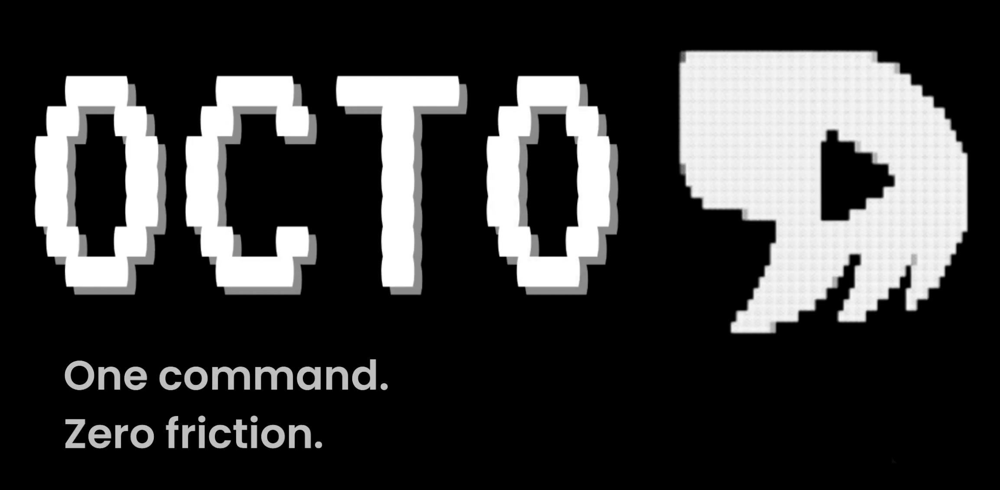

<p align="center">
  
</p>

<p align="center">
  <a href="https://github.com/Harshul23/Octo-CLI/releases">
    
  </a>
  <a href="https://github.com/Harshul23/Octo-CLI/stargazers">
    
  </a>
  <a href="https://github.com/Harshul23/Octo-CLI/blob/main/LICENSE">
    
  </a>
</p>

# Octo CLI


**Automate local deployment of any software with zero configuration.**

Octo is a CLI tool that analyzes your codebase, detects the tech stack, and generates a deployment configuration file to run your application locally.


## Features

- 🔍 **Automatic Detection** - Detects programming languages, frameworks, and package managers
- ⚡ **Zero Configuration** - Get started with a single command
- 🐳 **Multiple Runtimes** - Supports Docker, Nix, and shell-based execution
- 📦 **Framework Aware** - Understands popular frameworks and their conventions

## Installation


### From Source

```bash
git clone https://github.com/harshul23/octo-cli.git
cd octo-cli
./scripts/install.sh
```

### Using Go

```bash
go install github.com/harshul/octo-cli/cmd@latest
```

## Quick Start

1. Navigate to your project directory:

```bash
cd your-project
```

2. Initialize Octo:

```bash
octo init
```

This will analyze your codebase and generate a `.octo.yaml` file.

3. Run your application:

```bash
octo run
```

## Commands

### `octo init`

Analyzes the codebase and generates a `.octo.yaml` configuration file.

```bash
octo init [flags]

Flags:
  -o, --output string   Output file path (default ".octo.yaml")
  -f, --force           Overwrite existing configuration
  -i, --interactive     Run in interactive mode with prompts
```

### `octo run`

Executes the software based on the `.octo.yaml` file.

```bash
octo run [flags]

Flags:
  -c, --config string   Configuration file path (default ".octo.yaml")
  -e, --env string      Environment to run (default "development")
  -b, --build           Run build step (default true)
  -w, --watch           Watch for file changes and restart
  -d, --detach          Run in detached mode (background)
```

## Configuration

The `.octo.yaml` file structure:

```yaml
name: my-project
language: Go
version: "1.21"
run: go run main.go
```

**Fields:**

- `name` - The project name (required)
- `language` - The detected programming language (e.g., Node, Java, Python, Go, Rust, Ruby)
- `version` - The language/runtime version
- `run` - The command to execute the application

## Supported Languages & Frameworks

| Language   | Package Managers | Frameworks       |
| ---------- | ---------------- | ---------------- |
| Go         | go mod           | Gin, Echo, Fiber |
| JavaScript | npm, yarn, pnpm  | React, Next.js   |
| Python     | pip, poetry      | Django, Flask    |
| Rust       | cargo            | Actix, Rocket    |
| Ruby       | bundler          | Rails, Sinatra   |
| Java       | maven, gradle    | Spring Boot      |

## Contributing

Contributions are welcome! Please read our [Contributing Guide](CONTRIBUTING.md) for details.

## License

MIT License - see [LICENSE](LICENSE.md) for details.
